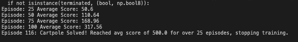

# PPO Implementation

Welcome to the repository for my implementation of **Proximal Policy Optimization (PPO)**! This project is designed to showcase a step-by-step implementation of PPO, including the use of TensorFlow for building policy and value networks, along with various visualizations to analyze the training process. 

This repository is intended for those interested in understanding and experimenting with reinforcement learning (RL) algorithms.

---

## **Overview**

PPO is a state-of-the-art policy optimization algorithm in reinforcement learning, widely used for solving complex decision-making problems. This project demonstrates the application of PPO to the **CartPole-v1** environment, a classic RL problem. The implementation highlights the following key features:
- Policy and Value Network design using TensorFlow
- Clipped surrogate objective for policy optimization
- Generalized Advantage Estimation (GAE) for advantage calculation
- Detailed training visualizations, including learning curves, trajectory lengths, and PPO-specific metrics

---

## **Project Structure**

- **`PPO_Implementation.py`**: The main script implementing the PPO algorithm and its components, including the policy and value networks.
- **`graphs`**: Various plots generated during training, such as:
  - Training rewards per episode
  - Moving average of rewards
  - Clipped surrogate function visualization
  - Trajectory length analysis
- **`README.md`**: Documentation for understanding the repository structure and usage (you are reading it now!).

---

## **Key Features**
1. **Custom TensorFlow Networks**:
   - Policy and Value Networks designed from scratch.
   - Flexible hyperparameters for network sizes and learning rates.

2. **Visualizations**:
   - Learning curves showing rewards per episode and moving averages.
   - PPO-specific metrics, like the clipped surrogate function.
   - Trajectory lengths and their progression during training.

3. **CartPole-v1 Environment**:
   - A benchmark environment from OpenAI Gym to demonstrate PPO's effectiveness.

4. **Integration with Medium Article**:
   - A detailed breakdown of this implementation is available in my [Medium article](https://medium.com/@mahad.shaikh_24075/bioengineering-and-ppo-8a90d50c830a).

---

## **How to Use**

1. **Clone the Repository**:
   ```bash
   git clone https://github.com/MahadParwaiz/PPO.py.git
   cd PPO.py
   ```

2. **Install Dependencies**:
   Make sure you have Python 3.9 installed. Use the following command to install the required libraries:
   ```bash
   pip install tensorflow gym matplotlib
   ```

3. **Run the PPO Implementation**:
   Execute the script to train the agent on CartPole-v1:
   ```bash
   python PPO.py
   ```

4. **Analyze Results**:
   - The script generates various graphs to analyze PPO's performance. These include reward curves, trajectory lengths, and PPO-specific surrogate loss plots.
   - Graphs are displayed at runtime and saved for future reference.

---

## **Results**

PPO achieves remarkable performance on the CartPole-v1 environment, stabilizing at a reward of **500** in less than 100 episodes. The detailed graphs provide insights into the training process, including:
- Reward progression over episodes
- The effectiveness of clipping in PPO's surrogate objective
- Policy convergence and trajectory improvements

---

## **Read More**

For a deep dive into the concepts, implementation details, and the bioengineering inspiration behind this project, read my [Medium article](https://medium.com/@mahad.shaikh_24075/bioengineering-and-ppo-8a90d50c830a).

---

## **Future Improvements**

Here are a few directions to explore further:
1. Extending PPO to more complex environments (e.g., Atari games or continuous control tasks).
2. Incorporating advanced PPO variants with adaptive clipping.
3. Optimizing the implementation for faster convergence on larger-scale problems.

---

## **Author**

**Mahad Parwaiz**  
- [GitHub](https://github.com/MahadParwaiz)  
- [Medium](https://medium.com/@mahad.shaikh_24075)  

If you have any questions or feedback, feel free to reach out or open an issue in this repository. Contributions are welcome!

---

## **License**

This project is licensed under the MIT License - see the [LICENSE](LICENSE) file for details.
